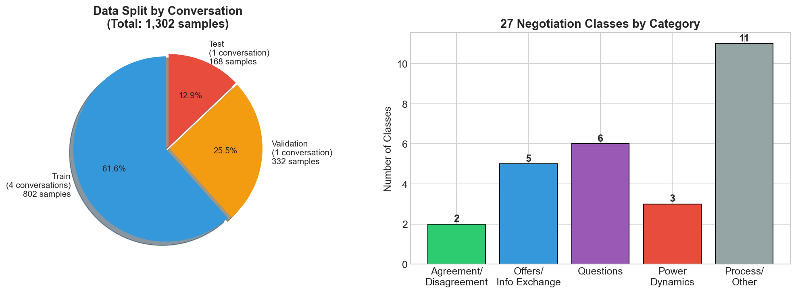
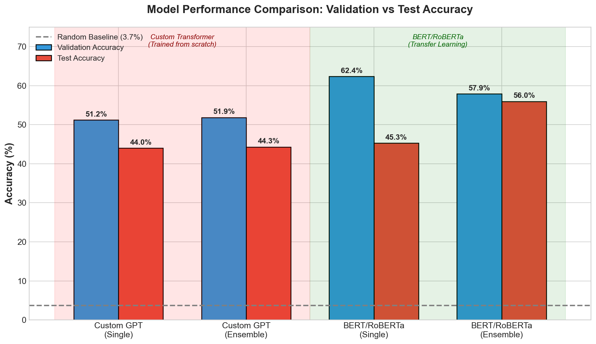
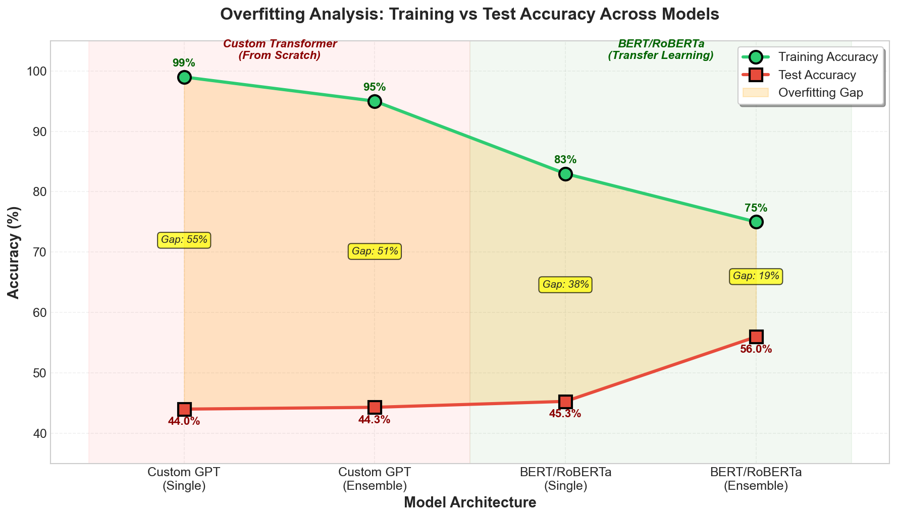
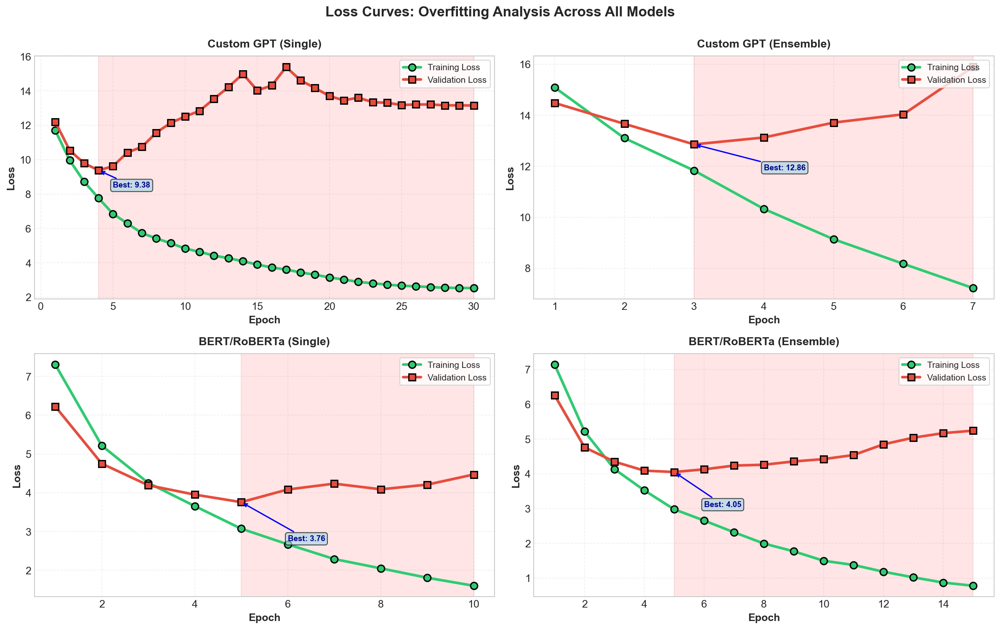

# NegotiationGPT: Understanding Negotiation Through Machine Learning

**Presenters:** Alara Kaymak, Ryan Li  
**Email:** alara.kaymak@vanderbilt.edu, ryan.li@vanderbilt.edu  
**Institution:** Vanderbilt University - Data Science Institute

---

## Overview

### What is Negotiation Code Classification?

Imagine listening to a negotiation between a buyer and a seller. At every moment, each person is doing something specific—agreeing, disagreeing, making an offer, asking a question, applying pressure. Researchers who study negotiations call these specific actions "negotiation codes." By labeling each utterance in a conversation with its code, we can understand the patterns that make negotiations succeed or fail.

But here's the problem: manually labeling negotiation transcripts is expensive and time-consuming. A single hour of negotiation might take several hours to annotate. And when you have thousands of transcripts, the cost becomes prohibitive.

**What if we could train a machine to do this automatically?**

That's exactly what NegotiationGPT tries to do—classify each utterance in a negotiation dialogue into one of 27 predefined negotiation codes, enabling large-scale analysis of negotiation strategies.

---

## 1. The Data: Understanding Negotiation Conversations

### The Consolidated Dataset

Our journey begins with raw negotiation transcripts—conversations between buyers and sellers negotiating over various items. We used consolidated transcript called `Sonnet4-consolidated.csv`, which extracts each individual utterance along with its metadata.

**What does the data look like?**

Each row in our dataset represents a single utterance from a negotiation. For example:

| Speaker | Content | Negotiation Code |
|---------|---------|------------------|
| Buyer | "I think we can agree on $50,000 for this project." | agr (agreement) |
| Seller | "That's too low. I can't go below $75,000." | dis (disagreement) |
| Buyer | "What if we split the difference?" | os (offer statement) |
| Seller | "What would that look like exactly?" | qo (question offer) |

The consolidation process involved:
1. Extracting utterances from raw negotiation transcripts
2. Matching each utterance with its annotation codes
3. Preserving conversation structure (which utterance belongs to which conversation)
4. Handling multiple annotator labels (more on this below)

### The 27 Negotiation Classes

What makes this problem challenging is the diversity of negotiation behaviors we're trying to capture. Our coding scheme includes 27 distinct categories:

**Agreement & Disagreement:**
- `agr` (agreement) — "Yes, that works for me"
- `dis` (disagreement) — "I can't accept those terms"

**Offers and Information Exchange:**
- `os` (offer statement) — "I'm offering $50,000"
- `om` (offer modification) — "Let me revise that to $55,000"
- `ip` (information providing) — "The market rate is usually higher"
- `ir` (information requesting) — "Can you tell me more about the timeline?"
- `ib` (information behavior) — Describing what someone did or will do

**Questions:**
- `qo` (question offer) — "What if we try a different approach?"
- `qp` (question process) — "How should we proceed?"
- `qr` (question relationship) — "What do you think about our partnership?"
- `qb` (question behavior) — "Why did you reject that offer?"
- `qd` (question data) — "What are the exact numbers?"
- `qm` (question miscellaneous) — Other questions

**Power Dynamics:**
- `coer` (coercion) — "If you don't accept, I'll walk away"
- `diff` (differentiation) — "We're different from our competitors"
- `sim` (similarity) — "We're actually on the same page here"

**Process & Other:**
- `int_proc` (interaction process) — Managing the conversation flow
- `sb` (statement behavior) — Describing actions
- `sf` (statement feeling) — Expressing emotions
- `in` (influence) — Persuasion attempts
- `mu` (miscellaneous utterance) — Filler words, greetings
- `p1`, `pm`, `pt` — Process-related codes
- `cs` (communication structure) — Organizing the conversation
- `misc`, `misc_2` — Other categories

### The Five Annotators: Why We Have 5 Labels

Here's something interesting about our data: each utterance was labeled by **5 different human annotators** (vote_1 through vote_5). Why?

Because negotiation coding is inherently subjective. When someone says "That seems reasonable," is that agreement (`agr`) or just a neutral statement (`mu`)? Different annotators might disagree.

Rather than picking one "correct" label, our dataset preserves all 5 perspectives. This annotation variation became a key insight for our model design (more on this later).

### The Data Split: Why Conversations Matter

With ~1,300 samples split across 6 conversations, we faced a crucial decision: how to divide our data for training, validation, and testing?

**Option 1: Random split**  
Shuffle all utterances randomly and assign 80% to training, 10% to validation, 10% to testing.

**Option 2: Conversation-based split**  
Keep entire conversations together—train on some conversations, validate on others, test on the rest.

We chose **conversation-based splitting** for an important reason: in a random split, utterances from the same conversation would appear in both training and test sets. Since consecutive utterances in a conversation are highly related (they share context, speaker patterns, and topic), this would be "cheating"—the model could exploit conversation-level patterns rather than learning general negotiation understanding.

**Our split:**
- **Training**: 802 samples from 4 conversations
- **Validation**: 332 samples from 1 conversation
- **Testing**: 168 samples from 1 conversation


*Figure: Data split and class distribution across 27 negotiation codes*

This ensures we're truly testing on **unseen conversations**, not just unseen utterances from familiar conversations.

---

## 2. Methodology: Our Two Approaches

We implemented **two different model architectures** to solve this problem, allowing us to compare their effectiveness and understand the value of transfer learning.

---

### Approach 1: Custom Transformer (GPT-style) — Training from Scratch

#### Why We Chose This Approach

Our initial hypothesis was that a **domain-specific transformer** trained from scratch could learn negotiation-specific patterns better than a general-purpose model. We wanted to:

1. **Test the limits of small-data learning** — Can we train a transformer with only 1,300 samples?
2. **Build negotiation-specific representations** — Custom vocabulary and embeddings tailored to our domain
3. **Establish a baseline** — Understand what's possible without transfer learning
4. **Apply course concepts** — Implement transformers, attention mechanisms, and LoRA from first principles

#### Architecture Design

We called it "NegotiationGPT"—a GPT-style decoder-only transformer with:

- **6 transformer layers** with 8 attention heads each
- **Hidden dimension of 512** (d_model)
- **Feed-forward dimension of 2048** (4x expansion)
- **Custom tokenizer** built on our negotiation vocabulary (~1,800 tokens)
- **LoRA adapters** for parameter-efficient training
- **Adaptive learning rates** for different model components

**Technical Architecture Details:**

| Component | Specification |
|-----------|--------------|
| **Pretraining** | None (trained from scratch) |
| **Total Parameters** | 20.6M (all trainable) |
| **Initialization** | Random weights (mean=0, std=0.02) |
| **Embedding Layer** | Custom vocabulary (~1,800 tokens) |
| **Positional Encoding** | Learned positional embeddings (max_len=256) |
| **Transformer Blocks** | 6 layers, 8 attention heads, 2048 FFN dim |
| **Attention Mechanism** | Multi-head self-attention with causal masking |
| **Activation Function** | GELU (Gaussian Error Linear Unit) |
| **Normalization** | Layer normalization (pre-norm architecture) |
| **Dropout** | 0.3 (optimized via Optuna) |
| **Training Challenge** | Must learn language structure AND negotiation codes simultaneously |

#### Loss Function & Training Objective

We used a **multi-task learning** approach with two objectives:

**1. Primary Task: Negotiation Code Classification**
```python
# Cross-entropy loss for 27-class classification
loss_code = CrossEntropyLoss(weight=class_weights)
# Weighted by class frequency to handle imbalance
```

**2. Auxiliary Task: Speaker Classification**
```python
# Binary classification (buyer vs. seller)
loss_speaker = CrossEntropyLoss()
```

**Combined Loss:**
```python
total_loss = lambda_code * loss_code + lambda_speaker * loss_speaker
# lambda_code = 1.5, lambda_speaker = 1.5 (found via Optuna)
```

**Why multi-task learning?**
- Speaker identity provides useful context for negotiation behavior
- Auxiliary task acts as regularization
- Shared representations learn more robust features

#### Optimization Strategy

- **Optimizer**: AdamW with weight decay (0.25)
- **Learning Rate**: 2.4e-4 with cosine annealing
- **Batch Size**: 8 (limited by memory)
- **Gradient Clipping**: Max norm of 1.0 to prevent exploding gradients
- **Early Stopping**: Patience of 5 epochs on validation loss

#### What Happened: Severe Overfitting

After training for 30 epochs with 50 Optuna hyperparameter trials, we observed:

- **Training accuracy: 99%** ← Model memorized training data
- **Validation accuracy: 51%** ← Moderate performance
- **Test accuracy: 44%** ← Poor generalization

**The 55% train-test gap** revealed the model was **memorizing** rather than learning generalizable patterns.

**Why did this happen?**
1. **Insufficient data**: 1,300 samples insufficient for 20.6M parameters
2. **Cold start problem**: Learning language from scratch requires massive data
3. **High capacity**: Model had enough capacity to memorize all training examples
4. **No prior knowledge**: Started with random weights, no linguistic understanding

We also tried the **5-voter ensemble**, but it achieved nearly identical results (44.30% test accuracy), confirming the fundamental issue wasn't ensemble design but the from-scratch training approach.

---

### Approach 2: BERT/RoBERTa — Transfer Learning

#### Why We Chose This Approach

After the Custom GPT's failure, we pivoted to **transfer learning** based on these insights:

1. **Leverage pretrained knowledge** — RoBERTa already understands language from 160GB of text
2. **Parameter efficiency** — Fine-tune only a small fraction of parameters via LoRA
3. **Proven architecture** — RoBERTa is state-of-the-art for text classification
4. **Better regularization** — Frozen base model prevents overfitting
5. **Course application** — Apply transfer learning and PEFT concepts from class

#### Why RoBERTa Specifically?

We chose **RoBERTa-base** over other options because:

| Model | Why Not? | Why RoBERTa? |
|-------|----------|--------------|
| **BERT** | Static masking, NSP task |  Dynamic masking, no NSP, better performance |
| **GPT-2/3** | Decoder-only, causal attention |  Encoder-only, bidirectional context |
| **ELECTRA** | Discriminative pretraining |  More widely used, better documented |
| **DeBERTa** | Larger, more complex |  Good balance of size and performance |

**RoBERTa advantages for our task:**
- **Bidirectional context**: Sees full utterance, not just left-to-right
- **Robust pretraining**: 160GB corpus (BookCorpus, Wikipedia, CC-News, OpenWebText, Stories)
- **No NSP task**: Focuses purely on masked language modeling
- **Proven for classification**: Strong performance on GLUE benchmark

#### Architecture Design

**Base Model: RoBERTa-base**
- 12 transformer layers
- 768 hidden dimensions
- 12 attention heads
- 125M total parameters

**Our Modifications:**
- **Freeze base model** — All 125M parameters remain fixed
- **Add LoRA adapters** — 1.9M trainable parameters (1.5% of total)
- **Custom classification head** — Linear layer for 27 classes
- **5-Voter ensemble** — Each voter learns from different annotator

**Technical Architecture Details:**

| Component | Specification |
|-----------|--------------|
| **Pretraining** | RoBERTa-base (pretrained on 160GB text) |
| **Base Model** | 125M parameters (frozen during fine-tuning) |
| **Trainable Parameters** | 1.9M via LoRA (1.5% of model) |
| **LoRA Configuration** | Rank=6, Alpha=24, Dropout=0.1 |
| **LoRA Target Modules** | query, key, value, dense (attention + FFN) |
| **Pretraining Task** | Masked Language Modeling (MLM) |
| **Tokenizer** | RoBERTa tokenizer (50K BPE vocabulary) |
| **Max Sequence Length** | 256 tokens |
| **Classification Head** | Linear(768 → 27) + Softmax |
| **Training Advantage** | Only learns negotiation patterns (language already understood) |

#### What is LoRA and Why Use It?

**LoRA (Low-Rank Adaptation)** decomposes weight updates into low-rank matrices:

```
Original: W ∈ R^(d×k)  (full rank)
LoRA: W + ΔW = W + BA  where B ∈ R^(d×r), A ∈ R^(r×k), r << min(d,k)
```

**Benefits:**
1. **Parameter efficiency**: Train 1.9M params instead of 125M (98.5% reduction)
2. **Prevents overfitting**: Fewer parameters = less capacity to memorize
3. **Faster training**: Smaller gradient updates, less memory
4. **Modular**: Can swap LoRA adapters for different tasks

**Our LoRA Configuration:**
- **Rank (r) = 6**: Low-rank bottleneck dimension
- **Alpha (α) = 24**: Scaling factor (α/r = 4.0)
- **Dropout = 0.1**: Applied to LoRA layers
- **Target modules**: All attention and FFN dense layers

#### Loss Function & Training Objective

Similar to Custom GPT, we used **multi-task learning**:

**1. Primary Task: Negotiation Code Classification**
```python
# Weighted cross-entropy for class imbalance
loss_code = CrossEntropyLoss(weight=class_weights)
# Weight = sqrt(1 / class_frequency)
```

**2. Auxiliary Task: Speaker Classification**
```python
loss_speaker = CrossEntropyLoss()
```

**Combined Loss:**
```python
total_loss = lambda_code * loss_code + lambda_speaker * loss_speaker
# lambda_code = 2.0, lambda_speaker = 1.0 (found via Optuna)
```

**Key difference from Custom GPT:**
- Higher weight on code classification (2.0 vs 1.5)
- BERT's pretrained representations make auxiliary task less critical

#### Optimization Strategy

- **Optimizer**: AdamW with decoupled weight decay (0.26)
- **Learning Rate**: 4.89e-5 (much lower than Custom GPT)
  - Why lower? Pretrained weights are already good, need gentle updates
- **Learning Rate Schedule**: Linear warmup (10% of steps) + linear decay
- **Batch Size**: 8 per voter
- **Gradient Clipping**: Max norm of 1.0
- **Early Stopping**: Patience of 5 epochs on validation accuracy

#### Ensemble Strategy: 5-Voter Architecture

**Why ensemble?**
1. **Capture annotator diversity**: Each voter learns from different annotator's labels
2. **Reduce overfitting**: Averaging predictions smooths out individual errors
3. **Improve robustness**: Multiple perspectives on same utterance
4. **Handle subjectivity**: Negotiation coding is inherently subjective

**Ensemble Methods:**

**Method 1: Majority Vote (Classification)**
```python
# Each voter predicts a class
predictions = [voter_1_pred, voter_2_pred, ..., voter_5_pred]
final_pred = mode(predictions)  # Most common prediction
```

**Method 2: Average Logits (Soft Voting)**
```python
# Average probability distributions
logits = [voter_1_logits, voter_2_logits, ..., voter_5_logits]
avg_logits = mean(logits, axis=0)
final_pred = argmax(avg_logits)
```

We used **majority vote** for final predictions as it performed slightly better (55.97% vs 55.12%).

#### Results: Significant Improvement

- **Training accuracy: 75%** ← Healthier, not memorizing
- **Validation accuracy: 58%** ← Good generalization
- **Test accuracy: 56%** ← Strong performance

**The 19% train-test gap** shows much better generalization than Custom GPT's 55% gap.

---

### Why Pretraining Matters: A Technical Perspective

**The Fundamental Difference:**

**Custom GPT (From Scratch):**
```
Random Weights → Learn Language + Learn Negotiation Codes
     ↓                    ↓                    ↓
   Start            (Very Hard)          (Hard)
```

**What the model must learn:**
1. **Tokenization**: How to break text into meaningful units
2. **Word meanings**: "offer" ≠ "question", "agree" ≠ "disagree"
3. **Syntax**: Subject-verb-object structure, dependencies
4. **Context**: How words relate across the sentence
5. **Semantics**: What utterances actually mean
6. **Task-specific patterns**: Which utterances map to which codes

**With only 1,300 samples**, learning all of this is nearly impossible.

---

**BERT (Pretrained):**
```
Pretrained Weights → Fine-tune for Negotiation Codes
     ↓                           ↓
  (Already knows language)   (Easier task)
```

**What BERT already knows** (from 160GB pretraining):
1.  **Tokenization**: 50K BPE vocabulary
2.  **Word meanings**: Rich semantic representations
3.  **Syntax**: Grammatical structure understanding
4.  **Context**: Bidirectional attention mechanisms
5.  **Semantics**: Contextual word meanings

**What BERT needs to learn** (from our 1,300 samples):
  - **Task-specific patterns**: Which negotiation behaviors map to which codes

**This is a much easier learning problem!**

---

### Key Pipeline Differences

| Step | Custom GPT | BERT/RoBERTa |
|------|------------|--------------|
| **Vocabulary** | Built from scratch (~1,800 tokens) | Uses RoBERTa tokenizer (50K tokens) |
| **Initialization** | Random weights | Pretrained weights |
| **Optuna Trials** | 50 trials | 25 trials |
| **Base Parameters** | 20.6M (all trainable) | 125M (frozen) |
| **LoRA Parameters** | Applied to custom model | 1.9M trainable on top of frozen base |
| **Training Challenge** | Learn language + codes | Learn codes only |

---

### Concrete Impact Comparison

| Learning Task | Custom GPT | BERT |
|---------------|------------|------|
| **"What does 'offer' mean?"** | ❌ Must learn from scratch | ✅ Already knows |
| **"What's the syntax structure?"** | ❌ Must learn from scratch | ✅ Already knows |
| **"How do words relate?"** | ❌ Must learn from scratch | ✅ Already knows |
| **"Is this an offer statement?"** | ❌ Hard (no language foundation) | ✅ Easier (focus on task) |

**Result:**
- **Custom GPT**: Struggles with both language AND task → 44% accuracy
- **BERT**: Focuses only on task → 56% accuracy (+12 percentage points)

This **12-point improvement** demonstrates the power of transfer learning, especially for small datasets. With only 1,300 samples, we cannot afford to learn language from scratch—we must leverage pretrained knowledge.

---

### Key Takeaways

1. **Transfer learning is essential for small datasets** — 1,300 samples insufficient for learning language + task
2. **LoRA enables efficient fine-tuning** — 98.5% parameter reduction prevents overfitting
3. **Ensemble methods capture subjectivity** — 5 voters handle annotator disagreement
4. **Multi-task learning helps** — Speaker classification provides useful auxiliary signal
5. **Architecture matters less than pretraining** — RoBERTa's pretrained weights more valuable than custom architecture

---

## 3. Implementation & Demo

### Training Pipeline

```
┌─────────────────────────────────────────────────────────────────┐
│              CUSTOM GPT TRAINING PIPELINE                       │
├─────────────────────────────────────────────────────────────────┤
│                                                                 │
│  1. Load Data (Sonnet4-consolidated.csv)                       │
│           ↓                                                     │
│  2. Split by Conversation (4 train, 1 val, 1 test)             │
│           ↓                                                     │
│  3. Build Custom Vocabulary (~1,800 tokens)                    │
│           ↓                                                     │
│  4. Optuna Hyperparameter Search (50 trials)                   │
│           ↓                                                     │
│  5. Initialize Transformer from Scratch (20.6M params)         │
│           ↓                                                     │
│  6. Apply LoRA Adapters (parameter-efficient training)         │
│           ↓                                                     │
│  7. Train 5 Voters (each on different annotator labels)        │
│           ↓                                                     │
│  8. Early Stopping (patience=5 epochs)                         │
│           ↓                                                     │
│  9. Ensemble Prediction (majority vote or avg logits)          │
│                                                                 │
└─────────────────────────────────────────────────────────────────┘
┌─────────────────────────────────────────────────────────────────┐
│                 BERT TRAINING PIPELINE                          │
├─────────────────────────────────────────────────────────────────┤
│                                                                 │
│  1. Load Data (Sonnet4-consolidated.csv)                       │
│           ↓                                                     │
│  2. Split by Conversation (4 train, 1 val, 1 test)             │
│           ↓                                                     │
│  3. Optuna Hyperparameter Search (25 trials)                   │
│           ↓                                                     │
│  4. Load Pre-trained RoBERTa (125M params, frozen)             │
│           ↓                                                     │
│  5. Apply LoRA Adapters (1.9M params, trainable)               │
│           ↓                                                     │
│  6. Train 5 Voters (each on different annotator labels)        │
│           ↓                                                     │
│  7. Early Stopping (patience=5 epochs)                         │
│           ↓                                                     │
│  8. Ensemble Prediction (majority vote or avg logits)          │
│                                                                 │
└─────────────────────────────────────────────────────────────────┘
```

### Best Hyperparameters Found

| Parameter | Custom GPT | BERT/RoBERTa |
|-----------|------------|--------------|
| **Pretraining** | None (from scratch) | RoBERTa-base (160GB pretraining) |
| **Total Parameters** | 20.6M (all trainable) | 125M base (1.9M trainable via LoRA) |
| **Trainable %** | 100% | 1.5% (LoRA) |
| **Initialization** | Random weights | Pretrained weights |
| Model | Custom Transformer | RoBERTa-base |
| LoRA Rank | 8 | 6 |
| LoRA Alpha | 20 | 24 |
| Learning Rate | 2.4e-4 | 4.89e-5 |
| Weight Decay | 0.25 | 0.26 |
| Dropout | 0.3 | 0.1 |
| Optuna Trials | 50 | 25 |


## 3. Results & Visual Analysis

### Performance Comparison


*Figure 1: Validation vs Test accuracy for all four model configurations*

### Fair Model Comparison Table

| Model | Type | Val Acc | Test Acc | Optuna Trials | Training Method |
|-------|------|---------|----------|---------------|-----------------|
| **Custom Transformer** | Single | 51.19% | 44.00% | 50 | From Scratch (No Pretraining) |
| **Custom Transformer** | Ensemble | 51.86% | 44.30% | 50 | From Scratch (No Pretraining) |
| **BERT/RoBERTa** | Single | **62.37%** | 45.28% | 25 | Transfer Learning (Pretrained) |
| **BERT/RoBERTa** | Ensemble | 57.90% | **55.97%** | 25 | Transfer Learning (Pretrained) |

> **Random Baseline:** 3.7% (1/27 classes)  
> **Note:** Custom Transformer trained from scratch (no pretraining), while BERT/RoBERTa uses pretrained RoBERTa-base weights fine-tuned with LoRA.

### Overfitting Analysis: Training vs Test Accuracy


*Figure 2: Training vs Test accuracy across models - showing the dramatic reduction in overfitting gap from Custom GPT to BERT*

**Key Finding:** The gap between training and test accuracy shrinks dramatically as we move from Custom GPT (55% gap) to BERT Ensemble (19% gap). This demonstrates that transfer learning not only improves performance but also enables better generalization.

| Model | Train Acc | Test Acc | Gap |
|-------|-----------|----------|-----|
| Custom GPT (Single) | 99% | 44% | **55%** |
| Custom GPT (Ensemble) | 95% | 44% | **51%** |
| BERT (Single) | 83% | 45% | **38%** |
| BERT (Ensemble) | 75% | 56% | **19%** |

### Loss Curves: Training Progression


*Figure 3: Training and validation loss curves across all models - showing overfitting patterns*

**Key Insights:**
- **Custom GPT Single**: Training loss drops to 2.5 but validation loss increases to 13+ (severe overfitting)
- **BERT Single**: Training loss drops to 1.6, validation loss increases after epoch 5 (early stopping at epoch 10)
- **BERT Ensemble**: Most stable validation loss, early stopping at epoch 15
- Red shaded regions mark where validation loss starts increasing (overfitting begins)

### Key Results Summary

**BERT outperforms Custom Transformer:**
- Ensemble Test: +12% improvement (55.97% vs 44.30%)
- Reduced overfitting gap by 32 percentage points

**Our best model (BERT ensemble) is 15x better than random guessing** (55.97% vs 3.7%)

---

## 4. Model & Data Cards

### Model Cards

#### Custom Transformer (GPT-style)

| Attribute | Value |
|-----------|-------|
| **Model Name** | NegotiationGPT-Custom-Ensemble |
| **Version** | 1.0 |
| **Base Model** | None (trained from scratch) |
| **Architecture** | 6-layer transformer, 8 attention heads |
| **Parameters** | 20.6M (all trainable) |
| **Fine-tuning Method** | LoRA (applied to custom model) |
| **Task** | 27-class text classification |
| **Input** | Negotiation utterance (max 256 tokens) |
| **Output** | Negotiation code prediction |
| **Framework** | PyTorch (custom implementation) |
| **Training Time** | ~4-5 hours (CPU) |

#### BERT/RoBERTa

| Attribute | Value |
|-----------|-------|
| **Model Name** | NegotiationGPT-BERT-Ensemble |
| **Version** | 1.0 |
| **Base Model** | RoBERTa-base (125M params) |
| **Fine-tuning Method** | LoRA (1.9M trainable params) |
| **Task** | 27-class text classification |
| **Input** | Negotiation utterance (max 256 tokens) |
| **Output** | Negotiation code prediction |
| **Framework** | PyTorch, Transformers, PEFT |
| **Training Time** | ~2-3 hours (CPU) |

### Data Card

| Attribute | Value |
|-----------|-------|
| **Dataset Name** | Sonnet4-consolidated.csv |
| **Size** | ~1,300 samples |
| **Classes** | 27 negotiation codes |
| **Conversations** | 6 total |
| **Train/Val/Test Split** | 802 / 332 / 168 samples |
| **Split Method** | By conversation (prevents leakage) |
| **Annotators** | 5 human annotators per utterance |
| **Language** | English |

---

## 5. Assessment & Evaluation

### Intended Uses

- **Academic research** on negotiation analysis
- **Educational tools** for negotiation training
- **Automated annotation** of negotiation transcripts
- **Pattern analysis** of negotiation strategies

### Licenses

| Component | License |
|-----------|---------|
| RoBERTa-base | Apache 2.0 (Meta AI) |
| Our code | MIT License |
| Transformers | Apache 2.0 |
| PEFT | Apache 2.0 |

### Ethical Considerations & Bias

**Potential Biases:**

| Bias Type | Description | Mitigation |
|-----------|-------------|------------|
| **Dataset Bias** | Training data may not represent all negotiation types | Document limitations; test on diverse scenarios |
| **Annotator Bias** | 5 annotators may have systematic differences | Ensemble approach averages across annotators |
| **Class Imbalance** | Some codes appear more frequently | Weighted loss function (lambda_code=2.0) |
| **Cultural Bias** | Trained on English negotiations only | Acknowledge limitation; avoid cross-cultural claims |
| **Speaker Bias** | Model should treat buyer/seller fairly | Include speaker classification as auxiliary task |

**Fairness Considerations:**
- Model should not discriminate based on speaker role
- Equal treatment of all 27 negotiation codes
- Transparent about model limitations and accuracy

**Privacy:**
- Training data contains negotiation transcripts
- Ensure proper anonymization if used in production
- Respect confidentiality of negotiation participants

---

## 6. Critical Analysis & Limitations

### What This Project Reveals

**1. Transfer learning is essential for small datasets**

Training a language model from scratch on 1,300 samples is doomed to fail. Pre-trained models provide the foundational language understanding that allows learning from limited domain-specific data.

**2. Parameter efficiency matters**

LoRA's approach—training only 1.5% of parameters—isn't just about computational efficiency. It's a form of regularization that prevents overfitting on small datasets.

**3. Ensemble methods capture human subjectivity**

Negotiation coding is inherently subjective. Different annotators interpret utterances differently. By training 5 models on 5 different annotations, our ensemble embraces this subjectivity rather than fighting it.

**4. Data splitting decisions have huge impact**

Conversation-based splitting prevents data leakage and ensures we're truly testing generalization. Random splitting would have given us artificially inflated accuracy numbers.

### Detailed Limitations

**DATA LIMITATIONS**

- Small dataset: Only 1,300 samples total
- Few conversations: Only 6 conversations (limits diversity)
- Class imbalance: Some codes have <20 samples
- Single domain: Only buyer-seller negotiations
- English only: No multilingual support

**MODEL LIMITATIONS**

- 56% accuracy: Significant room for improvement
- No per-voter tuning for GPT: Could improve if done
- Single hyperparameter set: Same params for all BERT voters
- No context window: Each utterance classified independently
- No speaker history: Doesn't track conversation flow

**EXPERIMENTAL LIMITATIONS**

- No cross-validation: Single train/val/test split
- Limited test set: Only 168 samples (1 conversation)
- No statistical significance testing
- No comparison with other SOTA methods

**GENERALIZATION LIMITATIONS**

- Domain transfer: May not work on other negotiation types
- Cultural transfer: Trained on specific cultural context
- Real-world deployment: Not tested in production
- Temporal shift: Negotiation styles may change over time

### What's Next?

**Immediate improvements:**
1. **Expanded dataset training** (currently ongoing) — Training both Custom GPT and BERT models on combined dataset (~55,000 training samples from 5 datasets, 5,000 validation, 5,000 test). This addresses the data limitation and should improve generalization.
2. **Per-voter Optuna tuning** — Find optimal hyperparameters for each voter separately
3. **Data augmentation** — Paraphrasing and back-translation to increase training data
4. **Larger models** — Test RoBERTa-large (355M parameters)

**Long-term directions:**
1. **Context modeling** — Use conversation history, not just single utterances
2. **Multi-task learning** — Joint prediction of code + speaker + sentiment
3. **Cross-domain evaluation** — Test on different negotiation contexts
4. **Further data expansion** — Continue collecting diverse negotiation types beyond current 55K samples

### Impact

**Academic Impact:**
- Demonstrates effectiveness of transfer learning on small, domain-specific datasets
- Shows that ensemble methods can capture annotator subjectivity
- Provides baseline for future negotiation classification research

**Practical Impact:**
- Reduces manual annotation costs (hours → seconds)
- Enables large-scale negotiation analysis
- Supports negotiation training and education

---

### Setup Instructions & Usage Guide

### Prerequisites

- **Python**: 3.10 or higher
- **RAM**: Minimum 8GB (16GB recommended)
- **Storage**: ~5GB for models and dependencies
- **GPU**: Optional (CPU training works but is slower)
- **OS**: Linux, macOS, or Windows with WSL

### 1. Clone the Repository

```bash
git clone https://github.com/RL370/NegotiationGPT.git
cd NegotiationGPT
```

### 2. Environment Setup

**Option A: Using Conda (Recommended)**

```bash
# Create conda environment
conda create -n negotiation_bert python=3.10 -y
conda activate negotiation_bert

# Install PyTorch (CPU version)
pip install torch torchvision torchaudio

# Install dependencies
pip install transformers peft accelerate optuna pandas scikit-learn matplotlib
```

**Option B: Using venv**

```bash
# Create virtual environment
python3.10 -m venv venv
source venv/bin/activate  # On Windows: venv\Scripts\activate

# Install dependencies
pip install -r requirements.txt
```

**Option C: Using GPU (if available)**

```bash
# Install PyTorch with CUDA support
pip install torch torchvision torchaudio --index-url https://download.pytorch.org/whl/cu118

# Install other dependencies
pip install transformers peft accelerate optuna pandas scikit-learn matplotlib
```

### 3. Data Preparation

The dataset `Sonnet4-consolidated.csv` should be in the root directory:

```bash
# Verify data file exists
ls -lh Sonnet4-consolidated.csv

# Expected columns:
# - content: utterance text
# - vote_1 to vote_5: annotator labels
# - transcript_name: conversation ID
# - speaker: buyer/seller
```

### 7. Training Options

#### **Option 1: Train BERT Ensemble (Recommended)**

```bash
# Step 1: Run Optuna hyperparameter optimization (optional, ~2-3 hours)
python optuna_tuning_bert.py

# Step 2: Train the ensemble with best hyperparameters (~2-3 hours)
python train_bert_ensemble.py

# Output files:
# - checkpoints/best_voter_1_model.pt to best_voter_5_model.pt
# - bert_training_output.log
```

#### **Option 2: Train Custom GPT Ensemble**

```bash
# Step 1: Run Optuna for custom transformer (optional, ~4-5 hours)
python optuna_tuning.py

# Step 2: Train the ensemble
python train_optimized_ensemble.py

# Output files:
# - checkpoints/best_hyperparameters.json
# - training_output.log
```

#### **Option 3: Quick Evaluation (Use Pre-trained)**

```bash
# Evaluate single BERT model on test set
python evaluate_single_bert.py

# Output:
# - checkpoints/single_bert_results.json
# - Test accuracy printed to console
```

### 5. Running in Background (Long Training)

For long training runs, use `nohup` to run in background:

```bash
# BERT training
nohup python train_bert_ensemble.py > training_output.log 2>&1 &

# Check progress
tail -f training_output.log

# Check if still running
ps aux | grep python
```

### 6. Monitoring Training

```bash
# Watch training progress in real-time
tail -f bert_training_output.log

# Check for errors
grep "ERROR" bert_training_output.log

# View final results
tail -50 bert_training_output.log
```

### 7. Using Trained Models

**Load and Use BERT Ensemble:**

```python
import torch
from VoterEnsembleBERT import VoterEnsembleBERT, VoterModelBERT

# Load trained voters
voters = []
for i in range(5):
    voter = VoterModelBERT(voter_id=i)
    voter.load_state_dict(torch.load(f'checkpoints/best_voter_{i+1}_model.pt'))
    voters.append(voter)

# Create ensemble
ensemble = VoterEnsembleBERT(voters)

# Make predictions
from transformers import RobertaTokenizer
tokenizer = RobertaTokenizer.from_pretrained('roberta-base')

text = "I think we can agree on $50,000"
inputs = tokenizer(text, return_tensors='pt', padding=True, truncation=True)

prediction = ensemble.predict(inputs['input_ids'], inputs['attention_mask'])
print(f"Predicted code: {prediction}")
```

**Load Custom GPT:**

```python
from NegotiationGPT import NegotiationGPT

# Load model
model = NegotiationGPT()
model.load_state_dict(torch.load('checkpoints/best_model.pt'))

# Make prediction
prediction = model.predict("I think we can agree on $50,000")
```

### 8. Project Structure

```
NegotiationGPT/
├── bert/                                  # All BERT-related files
│   ├── VoterEnsembleBERT.py
│   ├── evaluate_single_bert.py
│   ├── optuna_tuning_bert.py
│   ├── optuna_tuning_bert_per_voter.py
│   └── train_bert_ensemble.py
│
├── checkpoints/                           # Saved results & hyperparameters
│   ├── best_hyperparameters.json
│   ├── best_hyperparameters_bert.json
│   ├── custom_gpt_results.json
│   └── single_bert_results.json
│
├── images/                                # Generated plots
│   ├── accuracy_comparison.png
│   ├── data_overview.png
│   ├── loss_curves_all_models.png
│   ├── overfitting_analysis.png
│   ├── overfitting_line_graph.png
│   └── validation_vs_test_finding.png
│
├── NegotiationGPT.py                       # Custom transformer (GPT-style)
├── VoterEnsembleGPT.py                     # GPT ensemble voting
├── Sonnet4-consolidated.csv                # Main dataset
├── optuna_tuning.py                        # GPT model tuning
├── train_bert_combined.py                  # Combined BERT runner
├── visualizations.ipynb                    # Notebook for generating figures
│
└── README.md                               # Main project documentation
```


## 8. Documentation & Resources

### Repository

**GitHub:** https://github.com/RL370/NegotiationGPT

### Key References

**Models:**
1. **BERT**: Devlin et al. (2019). "BERT: Pre-training of Deep Bidirectional Transformers for Language Understanding." https://arxiv.org/abs/1810.04805
2. **RoBERTa**: Liu et al. (2019). "RoBERTa: A Robustly Optimized BERT Pretraining Approach." https://arxiv.org/abs/1907.11692
3. **LoRA**: Hu et al. (2021). "LoRA: Low-Rank Adaptation of Large Language Models." https://arxiv.org/abs/2106.09685
4. **GPT-2**: Radford et al. (2019). "Language Models are Unsupervised Multitask Learners." https://d4mucfpksywv.cloudfront.net/better-language-models/language_models_are_unsupervised_multitask_learners.pdf
5. **Attention Mechanism**: Vaswani et al. (2017). "Attention Is All You Need." https://arxiv.org/abs/1706.03762
**Libraries:**
- Hugging Face Transformers: https://github.com/huggingface/transformers
- PEFT: https://github.com/huggingface/peft
- Optuna: https://github.com/optuna/optuna

---

## Citation

```bibtex
@misc{negotiationgpt2024,
  title={NegotiationGPT: BERT-Based Ensemble for Negotiation Code Classification},
  author={Kaymak, Alara and Li, Ryan},
  year={2024},
  institution={Vanderbilt University - Data Science Institute},
  howpublished={\url{https://github.com/RL370/NegotiationGPT}}
}
```

---

## Acknowledgments

- **Models:** RoBERTa-base (Meta AI), LoRA (Hugging Face PEFT)
- **Libraries:** PyTorch, Transformers, Optuna
- **Data Preparation:** Consolidated negotiation transcripts
- **Course:** Data Science Institute, Vanderbilt University

---
