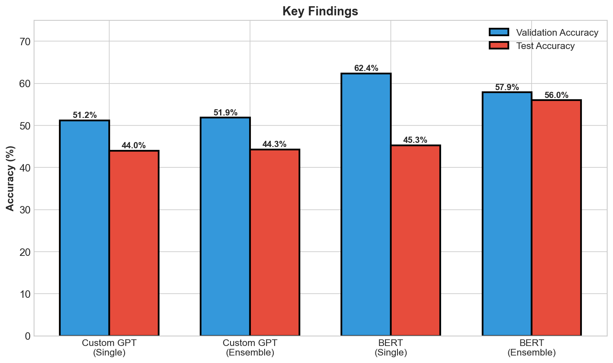
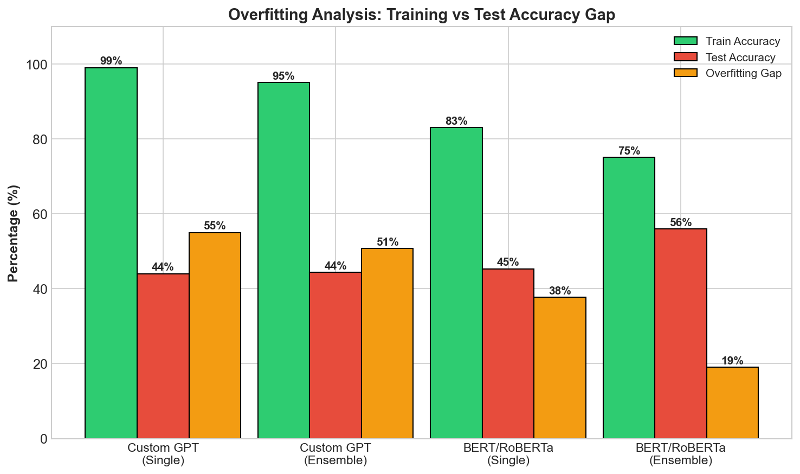

# NegotiationGPT: Understanding Negotiation Through Machine Learning

**Presenters:** Alara Kaymak, Ryan Li  
**Email:** alara.kaymak@vanderbilt.edu, ryan.li@vanderbilt.edu  
**Institution:** Vanderbilt University - Data Science Institute

---

## Overview

### What is Negotiation Code Classification?

Imagine listening to a negotiation between a buyer and a seller. At every moment, each person is doing something specific—agreeing, disagreeing, making an offer, asking a question, applying pressure. Researchers who study negotiations call these specific actions "negotiation codes." By labeling each utterance in a conversation with its code, we can understand the patterns that make negotiations succeed or fail.

But here's the problem: manually labeling negotiation transcripts is expensive and time-consuming. A single hour of negotiation might take several hours to annotate. And when you have thousands of transcripts, the cost becomes prohibitive.

**What if we could train a machine to do this automatically?**

That's exactly what NegotiationGPT tries to do—classify each utterance in a negotiation dialogue into one of 27 predefined negotiation codes, enabling large-scale analysis of negotiation strategies.

---

## 1. The Data: Understanding Negotiation Conversations

### The Consolidated Dataset

Our journey begins with raw negotiation transcripts—conversations between buyers and sellers negotiating over various items. Ryan consolidated these transcripts into a single dataset called `Sonnet4-consolidated.csv`, extracting each individual utterance along with its metadata.

**What does the data look like?**

Each row in our dataset represents a single utterance from a negotiation. For example:

| Speaker | Content | Negotiation Code |
|---------|---------|------------------|
| Buyer | "I think we can agree on $50,000 for this project." | agr (agreement) |
| Seller | "That's too low. I can't go below $75,000." | dis (disagreement) |
| Buyer | "What if we split the difference?" | os (offer statement) |
| Seller | "What would that look like exactly?" | qo (question offer) |

The consolidation process involved:
1. Extracting utterances from raw negotiation transcripts
2. Matching each utterance with its annotation codes
3. Preserving conversation structure (which utterance belongs to which conversation)
4. Handling multiple annotator labels (more on this below)

### The 27 Negotiation Classes

What makes this problem challenging is the diversity of negotiation behaviors we're trying to capture. Our coding scheme includes 27 distinct categories:

**Agreement & Disagreement:**
- `agr` (agreement) — "Yes, that works for me"
- `dis` (disagreement) — "I can't accept those terms"

**Offers and Information Exchange:**
- `os` (offer statement) — "I'm offering $50,000"
- `om` (offer modification) — "Let me revise that to $55,000"
- `ip` (information providing) — "The market rate is usually higher"
- `ir` (information requesting) — "Can you tell me more about the timeline?"
- `ib` (information behavior) — Describing what someone did or will do

**Questions:**
- `qo` (question offer) — "What if we try a different approach?"
- `qp` (question process) — "How should we proceed?"
- `qr` (question relationship) — "What do you think about our partnership?"
- `qb` (question behavior) — "Why did you reject that offer?"
- `qd` (question data) — "What are the exact numbers?"
- `qm` (question miscellaneous) — Other questions

**Power Dynamics:**
- `coer` (coercion) — "If you don't accept, I'll walk away"
- `diff` (differentiation) — "We're different from our competitors"
- `sim` (similarity) — "We're actually on the same page here"

**Process & Other:**
- `int_proc` (interaction process) — Managing the conversation flow
- `sb` (statement behavior) — Describing actions
- `sf` (statement feeling) — Expressing emotions
- `in` (influence) — Persuasion attempts
- `mu` (miscellaneous utterance) — Filler words, greetings
- `p1`, `pm`, `pt` — Process-related codes
- `cs` (communication structure) — Organizing the conversation
- `misc`, `misc_2` — Other categories

### The Five Annotators: Why We Have 5 Labels

Here's something interesting about our data: each utterance was labeled by **5 different human annotators** (vote_1 through vote_5). Why?

Because negotiation coding is inherently subjective. When someone says "That seems reasonable," is that agreement (`agr`) or just a neutral statement (`mu`)? Different annotators might disagree.

Rather than picking one "correct" label, our dataset preserves all 5 perspectives. This annotation variation became a key insight for our model design (more on this later).

### The Data Split: Why Conversations Matter

With ~1,300 samples split across 6 conversations, we faced a crucial decision: how to divide our data for training, validation, and testing?

**Option 1: Random split**  
Shuffle all utterances randomly and assign 80% to training, 10% to validation, 10% to testing.

**Option 2: Conversation-based split**  
Keep entire conversations together—train on some conversations, validate on others, test on the rest.

We chose **conversation-based splitting** for an important reason: in a random split, utterances from the same conversation would appear in both training and test sets. Since consecutive utterances in a conversation are highly related (they share context, speaker patterns, and topic), this would be "cheating"—the model could exploit conversation-level patterns rather than learning general negotiation understanding.

**Our split:**
- **Training**: 802 samples from 4 conversations
- **Validation**: 332 samples from 1 conversation
- **Testing**: 168 samples from 1 conversation


*Figure: Data split and class distribution across 27 negotiation codes*

This ensures we're truly testing on **unseen conversations**, not just unseen utterances from familiar conversations.

---

## 2. Methodology: Our Two Approaches

We implemented **two different model architectures** to solve this problem, allowing us to compare their effectiveness:

### Approach 1: Custom Transformer (GPT-style) — Training from Scratch

Our first instinct was to build a custom transformer model specifically designed for negotiation classification. We called it "NegotiationGPT"—a GPT-style transformer with:

- 6 transformer layers with 8 attention heads
- Hidden dimension of 512
- Custom tokenizer built on our negotiation vocabulary
- LoRA adapters for parameter efficiency
- Adaptive learning rates for different model components

**What happened:**

After training for 30 epochs with 50 Optuna hyperparameter trials, we saw severe overfitting:
- **Training accuracy: 99%**
- **Test accuracy: 44%**

The 55% gap showed the model was **memorizing** rather than learning. We also tried the 5-voter ensemble, but it achieved nearly identical results (44.30% test accuracy).

### Approach 2: BERT/RoBERTa — Transfer Learning

This failure led us to explore transfer learning with pre-trained models. Instead of learning language from scratch, we fine-tuned RoBERTa-base—a model pre-trained on 160GB of text data.

**Key techniques:**
- **LoRA (Low-Rank Adaptation)**: Train only 1.9M parameters (1.5%) instead of all 125M
- **5-Voter Ensemble**: Each voter learns from a different annotator's perspective
- **Optuna Optimization**: 25 trials to find optimal hyperparameters
- **Early Stopping**: Prevent overfitting by stopping when validation accuracy plateaus

---

## 3. Implementation & Demo

### Training Pipeline

```
┌─────────────────────────────────────────────────────────────────┐
│                    TRAINING PIPELINE                            │
├─────────────────────────────────────────────────────────────────┤
│                                                                 │
│  1. Load Data (Sonnet4-consolidated.csv)                       │
│           ↓                                                     │
│  2. Split by Conversation (4 train, 1 val, 1 test)             │
│           ↓                                                     │
│  3. Optuna Hyperparameter Search (25 trials)                   │
│           ↓                                                     │
│  4. Load Pre-trained RoBERTa (125M params, frozen)             │
│           ↓                                                     │
│  5. Apply LoRA Adapters (1.9M params, trainable)               │
│           ↓                                                     │
│  6. Train 5 Voters (each on different annotator labels)        │
│           ↓                                                     │
│  7. Early Stopping (patience=5 epochs)                         │
│           ↓                                                     │
│  8. Ensemble Prediction (majority vote or avg logits)          │
│                                                                 │
└─────────────────────────────────────────────────────────────────┘
```

### Best Hyperparameters Found

| Parameter | Custom GPT | BERT/RoBERTa |
|-----------|------------|--------------|
| Model | Custom Transformer | RoBERTa-base |
| LoRA Rank | 8 | 6 |
| LoRA Alpha | 20 | 24 |
| Learning Rate | 2.4e-4 | 4.89e-5 |
| Weight Decay | 0.25 | 0.26 |
| Dropout | 0.3 | 0.1 |
| Optuna Trials | 50 | 25 |

### Setup Instructions

```bash
# Clone and setup
git clone https://github.com/RL370/NegotiationGPT.git
cd NegotiationGPT

# Create environment
conda create -n negotiation_bert python=3.10
conda activate negotiation_bert

# Install dependencies
pip install torch transformers peft accelerate optuna pandas

# Run hyperparameter optimization (optional)
python optuna_tuning_bert.py

# Train the ensemble
python train_bert_ensemble.py
```

---

## 4. Results & Visual Analysis

### Performance Comparison


*Figure 1: Validation vs Test accuracy for all four model configurations*

### Fair Model Comparison Table

| Model | Type | Val Acc | Test Acc | Optuna Trials |
|-------|------|---------|----------|---------------|
| **Custom Transformer** | Single | 51.19% | 44.00% | 50 |
| **Custom Transformer** | Ensemble | 51.86% | 44.30% | 50 |
| **BERT/RoBERTa** | Single | **62.37%** | 45.28% | 25 |
| **BERT/RoBERTa** | Ensemble | 57.90% | **55.97%** | 25 |

> **Random Baseline:** 3.7% (1/27 classes)

### Key Finding: The Overfitting Trap


*Figure 2: Single BERT achieved highest validation but lowest test accuracy!*

**What happened?** Single BERT learned the validation conversation *too well*. With only 1 conversation for validation, the model optimized for patterns specific to that conversation rather than learning general negotiation behaviors.

**The lesson:** High validation accuracy ≠ High test accuracy, especially with small datasets. This is why **ensemble methods won**—they average across 5 annotator perspectives, reducing overfitting.

### Overfitting Analysis


*Figure 3: Training vs Test accuracy gap across all models*

| Model | Train Acc | Test Acc | Gap |
|-------|-----------|----------|-----|
| Custom GPT (Single) | 99% | 44% | **55%** ← Severe |
| Custom GPT (Ensemble) | 95% | 44% | **51%** ← Severe |
| BERT (Single) | 83% | 45% | **38%** ← High |
| BERT (Ensemble) | 75% | 56% | **19%** ← Best |

### Key Results Summary

**BERT outperforms Custom Transformer:**
- Ensemble Test: +12% improvement (55.97% vs 44.30%)
- Reduced overfitting gap by 32 percentage points

**Our best model (BERT ensemble) is 15x better than random guessing** (55.97% vs 3.7%)

---

## 5. Model & Data Cards

### Model Card

| Attribute | Value |
|-----------|-------|
| **Model Name** | NegotiationGPT-BERT-Ensemble |
| **Version** | 1.0 |
| **Base Model** | RoBERTa-base (125M params) |
| **Fine-tuning Method** | LoRA (1.9M trainable params) |
| **Task** | 27-class text classification |
| **Input** | Negotiation utterance (max 256 tokens) |
| **Output** | Negotiation code prediction |
| **Framework** | PyTorch, Transformers, PEFT |
| **Training Time** | ~2-3 hours (CPU) |

### Data Card

| Attribute | Value |
|-----------|-------|
| **Dataset Name** | Sonnet4-consolidated.csv |
| **Size** | ~1,300 samples |
| **Classes** | 27 negotiation codes |
| **Conversations** | 6 total |
| **Train/Val/Test Split** | 802 / 332 / 168 samples |
| **Split Method** | By conversation (prevents leakage) |
| **Annotators** | 5 human annotators per utterance |
| **Language** | English |

---

## 6. Assessment & Evaluation

### Intended Uses

- **Academic research** on negotiation analysis
- **Educational tools** for negotiation training
- **Automated annotation** of negotiation transcripts
- **Pattern analysis** of negotiation strategies

### Licenses

| Component | License |
|-----------|---------|
| RoBERTa-base | Apache 2.0 (Meta AI) |
| Our code | MIT License |
| Transformers | Apache 2.0 |
| PEFT | Apache 2.0 |

### Ethical Considerations & Bias

**Potential Biases:**

| Bias Type | Description | Mitigation |
|-----------|-------------|------------|
| **Dataset Bias** | Training data may not represent all negotiation types | Document limitations; test on diverse scenarios |
| **Annotator Bias** | 5 annotators may have systematic differences | Ensemble approach averages across annotators |
| **Class Imbalance** | Some codes appear more frequently | Weighted loss function (lambda_code=2.0) |
| **Cultural Bias** | Trained on English negotiations only | Acknowledge limitation; avoid cross-cultural claims |
| **Speaker Bias** | Model should treat buyer/seller fairly | Include speaker classification as auxiliary task |

**Fairness Considerations:**
- Model should not discriminate based on speaker role
- Equal treatment of all 27 negotiation codes
- Transparent about model limitations and accuracy

**Privacy:**
- Training data contains negotiation transcripts
- Ensure proper anonymization if used in production
- Respect confidentiality of negotiation participants

---

## 7. Critical Analysis & Limitations

### What This Project Reveals

**1. Transfer learning is essential for small datasets**

Training a language model from scratch on 1,300 samples is doomed to fail. Pre-trained models provide the foundational language understanding that allows learning from limited domain-specific data.

**2. Parameter efficiency matters**

LoRA's approach—training only 1.5% of parameters—isn't just about computational efficiency. It's a form of regularization that prevents overfitting on small datasets.

**3. Ensemble methods capture human subjectivity**

Negotiation coding is inherently subjective. Different annotators interpret utterances differently. By training 5 models on 5 different annotations, our ensemble embraces this subjectivity rather than fighting it.

**4. Data splitting decisions have huge impact**

Conversation-based splitting prevents data leakage and ensures we're truly testing generalization. Random splitting would have given us artificially inflated accuracy numbers.

### Detailed Limitations

```
┌─────────────────────────────────────────────────────────────────┐
│                    PROJECT LIMITATIONS                          │
├─────────────────────────────────────────────────────────────────┤
│                                                                 │
│  📊 DATA LIMITATIONS                                            │
│  ─────────────────                                              │
│  • Small dataset: Only 1,300 samples total                      │
│  • Few conversations: Only 6 conversations (limits diversity)   │
│  • Class imbalance: Some codes have <20 samples                 │
│  • Single domain: Only buyer-seller negotiations                │
│  • English only: No multilingual support                        │
│                                                                 │
│  🤖 MODEL LIMITATIONS                                           │
│  ──────────────────                                             │
│  • 56% accuracy: Significant room for improvement               │
│  • No per-voter tuning for GPT: Could improve if done           │
│  • Single hyperparameter set: Same params for all BERT voters   │
│  • No context window: Each utterance classified independently   │
│  • No speaker history: Doesn't track conversation flow          │
│                                                                 │
│  🔬 EXPERIMENTAL LIMITATIONS                                    │
│  ──────────────────────────                                     │
│  • No cross-validation: Single train/val/test split             │
│  • Limited test set: Only 168 samples (1 conversation)          │
│  • No statistical significance testing                          │
│  • No comparison with other SOTA methods                        │
│                                                                 │
│  🌍 GENERALIZATION LIMITATIONS                                  │
│  ───────────────────────────                                    │
│  • Domain transfer: May not work on other negotiation types     │
│  • Cultural transfer: Trained on specific cultural context      │
│  • Real-world deployment: Not tested in production              │
│  • Temporal shift: Negotiation styles may change over time      │
│                                                                 │
└─────────────────────────────────────────────────────────────────┘
```

### What's Next?

**Immediate improvements:**
1. **Per-voter Optuna tuning** (currently running) — Find optimal hyperparameters for each voter separately
2. **Data augmentation** — Paraphrasing and back-translation to increase training data
3. **Larger models** — Test RoBERTa-large (355M parameters)

**Long-term directions:**
1. **Collect more data** — Target 5,000+ samples across diverse negotiation types
2. **Context modeling** — Use conversation history, not just single utterances
3. **Multi-task learning** — Joint prediction of code + speaker + sentiment
4. **Cross-domain evaluation** — Test on different negotiation contexts

### Impact

**Academic Impact:**
- Demonstrates effectiveness of transfer learning on small, domain-specific datasets
- Shows that ensemble methods can capture annotator subjectivity
- Provides baseline for future negotiation classification research

**Practical Impact:**
- Reduces manual annotation costs (hours → seconds)
- Enables large-scale negotiation analysis
- Supports negotiation training and education

---

## 8. Documentation & Resources

### Repository

**GitHub:** https://github.com/RL370/NegotiationGPT

### Key References

**Models:**
1. **BERT**: Devlin et al. (2019). "BERT: Pre-training of Deep Bidirectional Transformers for Language Understanding." https://arxiv.org/abs/1810.04805
2. **RoBERTa**: Liu et al. (2019). "RoBERTa: A Robustly Optimized BERT Pretraining Approach." https://arxiv.org/abs/1907.11692
3. **LoRA**: Hu et al. (2021). "LoRA: Low-Rank Adaptation of Large Language Models." https://arxiv.org/abs/2106.09685

**Libraries:**
- Hugging Face Transformers: https://github.com/huggingface/transformers
- PEFT: https://github.com/huggingface/peft
- Optuna: https://github.com/optuna/optuna

---

## Citation

```bibtex
@misc{negotiationgpt2024,
  title={NegotiationGPT: BERT-Based Ensemble for Negotiation Code Classification},
  author={Kaymak, Alara and Li, Ryan},
  year={2024},
  institution={Vanderbilt University - Data Science Institute},
  howpublished={\url{https://github.com/RL370/NegotiationGPT}}
}
```

---

## Acknowledgments

- **Models:** RoBERTa-base (Meta AI), LoRA (Hugging Face PEFT)
- **Libraries:** PyTorch, Transformers, Optuna
- **Data Preparation:** Ryan Li (consolidated negotiation transcripts)
- **Course:** Data Science Institute, Vanderbilt University

---
